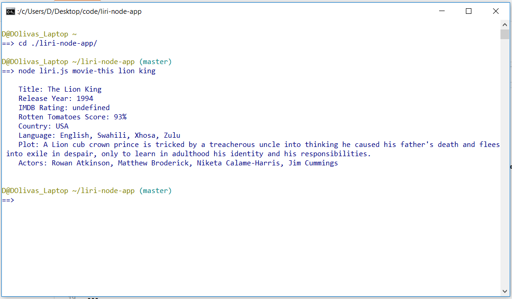

#
<h1>

Liri App

</h1>

### Liri is a NodeJS based command line app that takes in parameters and gives data back.  Liri is capable of returning the first 20 tweets from a given Twitter account, Returning album information for a given song, or returning information on a given movie using OMDB.  Simply give Liri one of the following commands: 
  - my-tweets (*account name*)
  - spotify-this-song (*song name*)
  - movie-this (*movie name*)
  
### You can also tell Liri to 'do-what-it-says' and the app will execute whatever command has been added to the random.txt file.

---

This project was created and is maintained by Daniel Olivas

To get help:  
me@danielolivas.net 
http://danielolivas.net
